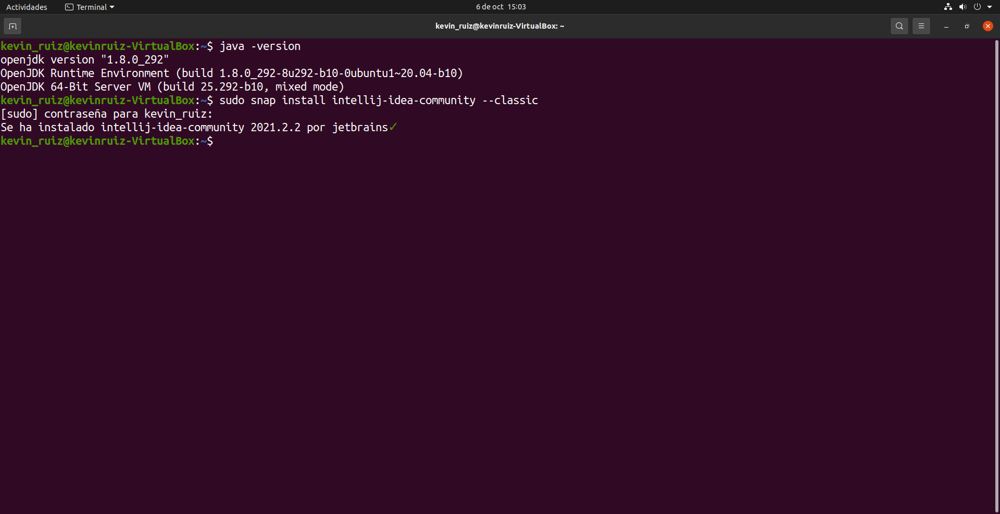
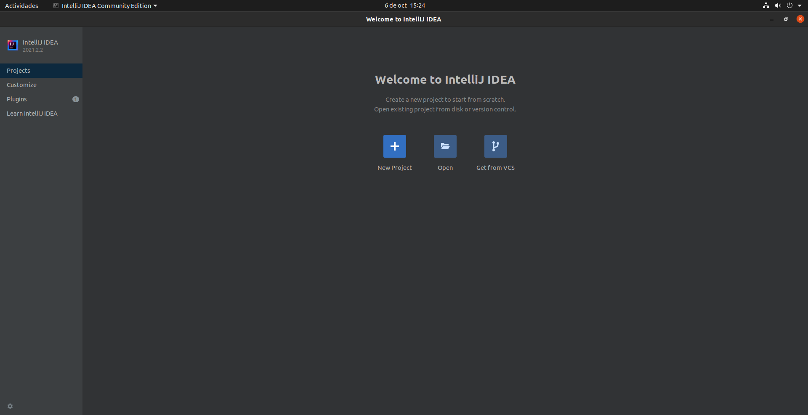

# IntelliJ
## Índice
* [Introducción](#introducción)  
<a name="introducción"/>

* [Requisitos](#requisitos)  
<a name="requisitos"/>

* [Instalación](#instalación)  
<a name="instalación"/>

* [Ejecución](#ejecución)  
<a name="ejecución"/>

  ## Introducción
  En este proyecto, trataremos la instalación del entorno de desarrollo integrado IntelliJ IDEA.
  
  Este es uno de los IDE más usados a nivel mundial. Se enfoca principalmente para el desarrollo en lenguaje Java.
  
  ## Requisitos
  En primer lugar, como se ha dicho en el punto anterior, este tutorial será enfocado a la distribución de Linux, Ubuntu. Por lo que, aunque es posible la instalación en 
  otros sistemas operativos como Windows o macOS, los pasos serán distintos a los realizados en este proyecto.
  
  En mi caso, estoy utilizando la aplicación “Virtualbox” para virtualizar Ubuntu en una máquina virtual. Los pasos son exactamente los mismos que si dicho sistema operativo 
  estuviera instalado de forma nativa en el equipo.
  
  Necesitaremos también una conexión a internet para poder realizar las descargas.
  
  Finalmente, será necesario tener instalado Java en nuestro equipo.
  
  Podemos comprobar esto último introduciendo un simple comando en nuestra terminal: 
  
    java -version
  
  Debería aparecer algo parecido a lo siguiente:
  
  
  
  Como se puede apreciar, yo tengo instalada la versión 8 del JDK, lo cual significa “Java Developer Kit” o kit de desarrollo de Java. Por lo que, podemos comenzar con la 
  instalación.
  
  ## Instalación
  Para la instalación usaremos los paquetes Snap. Pues con este método podremos hacer una instalación más rápida y eficiente.
  
  Veremos que el proceso es muy sencillo.
  
  Lo único que tendremos que hacer es ir a nuestra terminal e introducir el siguiente comando: 
  
    sudo snap install intellij-idea-community –classic
  
  En ese momento nos pedirá nos pedirá nuestra contraseña y una vez introducida empezará la instalación.
  
  
  
  Esperamos unos minutos y una vez que termine, ya tendremos instalado este IDE en nuestro equipo.
  
  ## Ejecución
  En último lugar, para comprobar que todo ha ido de manera correcta, ejecutaremos el programa:
  
  
  
  Como podemos ver, se nos abre la página de inicio. En este punto, estamos listos para comenzar a trabajar con IntelliJ. 
 

