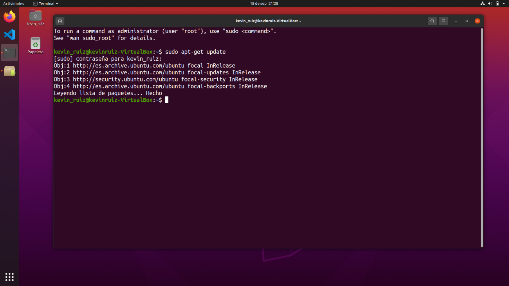

# Instalación JDK

## Índice
* [Introducción](#introducción)  
<a name="introducción"/>

* [Requisitos](#requisitos)  
<a name="requisitos"/>

* [JDK](#jdk)  
<a name="jdk"/>

* [Instalación](#instalación)  
<a name="instalación"/>

* [Versión específica](#versión-específica)  
<a name="versión-específica"/>

* [Variables de entorno](#variables-de-entorno)  
<a name="variables-de-entorno"/>

* [Primeros pasos](#primeros-pasos)  
<a name="primeros-pasos"/>

<div align="justify">

  ## Introducción
  En el día de hoy, llevaremos a cabo la instalación del lenguaje de programación Java en un sistema operativo.

  El objetivo de este proyecto es mostrar los pasos necesarios a seguir para realizar correctamente la instalación de dicho lenguaje y sus correspondientes complementos en 
  nuestro equipo.

  En este caso, el proceso se llevará a cabo en un sistema operativo Linux, concretamente en la distribución Ubuntu 20.04, una de las más conocidas y usadas dentro del 
  mencionado sistema operativo

  ## Requisitos
  Necesitaremos un ordenador con sistema operativo Linux, en este caso.

  También se puede optar por hacer uso de una máquina virtual, como es mi caso. Yo me encuentro usando un portátil con sistema operativo Windows 10 y mediante el 
  programa “VirtualBox”, estoy virtualizando la distribución Ubuntu 20.04 LTS.

  Por supuesto, será también necesario disponer de una conexión a internet.

  Una de las comprobaciones que debemos llevar a cabo, es asegurarnos de que no tengamos ya instalado Java en nuestro equipo.

  Podemos comprobar esto tecleando en la terminal el comando: 
  
    java -version 
  
  En caso de no tenerlo, nos aparecerá un mensaje como el siguiente:

   

  Una vez que estemos seguros de esto, podemos comenzar con el proceso.

  ## JDK
  En este punto, estamos listos para comenzar con la instalación en sí. Solo hay un punto que me gustaría resaltar antes de comenzar.

  Realmente, no realizaremos la instalación de Java como tal, ya que simplemente con esto, no sería suficiente para poder empezar a producir código en este lenguaje.

  Concretamente, lo que haremos aquí hoy es la instalación del JDK (java development kit) o kit de desarrollo de Java.

  ¿Qué es esto del kit de desarrollo de Java? Pues resulta que, debido a una de las principales características de este lenguaje, la cual es ser multiplataforma, no podemos 
  instalar solamente Java desde la página oficial y directamente empezar a ejecutar programas escritos en el mismo. También necesitaremos lo que se conoce como JRE (Java 
  Runtime Environment), entorno de ejecución Java. En sus inicios denominado como JVM (Java Virtual Machine) o máquina virtual de Java.

  Al ser, como hemos comentado, multiplataforma, implica que este lenguaje deba ser compilado y posteriormente interpretado. Para este último paso necesitamos el JRE.
  Y debido a que, nosotros no solo queremos correr programas escritos en Java, si no que como desarrolladores vamos a producirlos nosotros mismos también, hacemos uso del 
  JDK, pues este incluye tanto el lenguaje en sí y el entorno de ejecución, como las herramientas necesarias para el desarrollo, tales como: compilador, depurador, 
  desensamblador, etc.

  ## Instalación

  Ahora, finalmente, podemos empezar con la propia instalación.

  El primer paso, será confirmar que tengamos el sistema actualizado. Esto será necesario para asegurarnos de que no tendremos problemas de compatibilidad con la última 
  versión de JDK que se encuentre disponible.

  Para llevar esto a cabo, abriremos nuestra terminal e introduciremos el siguiente comando: 
  
    sudo apt-get update
  
  En el caso de que el sistema no estuviera actualizado, como fue mi caso, ocurrirá lo siguiente:

   

  Nos pedirá nuestra contraseña, ya que cuando ejecutamos un comando y añadimos al principio la orden “sudo”, estaremos haciéndolo en modo administrador, por lo que nos pide 
  que confirmemos con la contraseña por razones de seguridad. Inmediatamente, iniciará las actualizaciones necesarias.
  
  Seguidamente, por fin realizaremos la propia instalación en sí.
  
  Para instalar el JDK, más concretamente, el OpenJDK, pues Java es de pago y en nuestro caso usaremos una versión gratuita pero que funciona perfectamente también, será tan 
  sencillo como escribir en la terminal: 
  
    sudo apt-get install default-jdk 
  
  Si todo va bien, después de introducir nuestra contraseña, comenzará la instalación. Se vería tal que así:
  
  
  
  En un punto de la instalación nos pedirá confirmación para continuar, para hacer esto teclearemos una “S” de sí y presionaremos la tecla “enter”, de este modo continuará 
  con la instalación hasta que finalmente termine:
  
  
  
  Podemos confirmar que la instalación ha sido correcta haciendo uno de los pasos que hicimos al principio, el cual es comprobar que tengamos Java instalado.
  
  Si recordamos, el comando era:
  
    java -version 
  
  Esta vez nos debería salir algo distinto a lo que nos apareció anteriormente.
  
  
  
  Efectivamente, podemos comprobar que la instalación ha sido un éxito y que ahora tenemos la versión 11 del OpenJDK. 
  
  Llegados a este punto, ya estamos listos para empezar a trabajar con el lenguaje Java.
  
  ## Versión específica
  Con el método que acabamos de explicar se realizaría la instalación de la versión más reciente disponible. Sin embargo, si nos interesa instalar una versión específica, 
  también se puede hacer sin problemas, cambiando un poco el comando que ejecutamos.
  
  Veamos un ejemplo en el que instalamos la versión 8. 
  
  El comando que debemos ejecutar es el siguiente:
  
    sudo apt install openjdk-8-jdk
  
  Al hacer esto, empezará directamente la instalación exactamente igual que con el método anterior.
  
  
  
  
  
  Una vez que termina de instalarse todo lo necesario, podemos apreciar que efectivamente tenemos instalada la versión 8 si ejecutamos la orden que ya conocemos para 
  comprobar la versión de Java que tenemos instalada:
  
    java -version
  
  
  
  Y como podemos comprobar, nos aparece la versión 8 sin ningún problema.
  
  En el caso de que quisiéramos actualizar la versión en este momento, podríamos hacerlo, por ejemplo, de las siguientes formas:
  
  * Versión 9:
  
  ```
    sudo apt install openjdk-9-jdk
  ```
  
  * Versión 11:
  
  ```
    sudo apt install openjdk-11-jdk
  ```
  
  ## Variables de entorno
  Si tenemos varias versiones instaladas, podemos configurar lo que se llama “variables de entorno”, para decirle a Linux la versión de Java que queremos usar de manera 
  predeterminada.
  
  Para esto necesitaremos un editor de texto. En mi caso usaremos Nano, este viene incorporado en Ubuntu.
  
  Teclearemos el comando:
  
    sudo nano /etc/profile
  
  Y se nos abrirá automáticamente.
  
   
  
  Una vez aquí, tendremos que escribir lo siguiente:
  
    # Java version
    JAVA_HOME=/usr/java/(VERSIÓN CORRESPONDIENTE DE JDK)
    PATH=$PATH:$HOME/bin:$JAVA_HOME/bin
    export JAVA_HOME
    export JRE_HOME
    export PATH
  
  Sustituiremos el texto marcado entre paréntesis por la versión especifica que queramos establecer como predeterminada.
  
  Luego de esto, guardamos los cambios y habremos finalizado con la configuración.
  
  ## Primeros pasos
  
  En este punto, ya podríamos empezar a trabajar con Java, y como es costumbre en el mundo de la programación, el primer código que aprendemos a escribir cada vez que 
  comenzamos con un nuevo lenguaje suele ser el mítico: “Hola mundo”.
  
  Así que veamos como sería en nuestro recién instalado Java.
  
  Lo primero será abrir un editor de código, cualquiera con el que nos sintamos cómodos. En mi caso será Visual Studio Code y pasamos directamente a escribir el código.
  
  Se vería de la siguiente forma:
  
  
  
  Ahora que ya hemos dado el primer paso, estamos listos para continuar desarrollando programas más complejos en este lenguaje.
</div>
