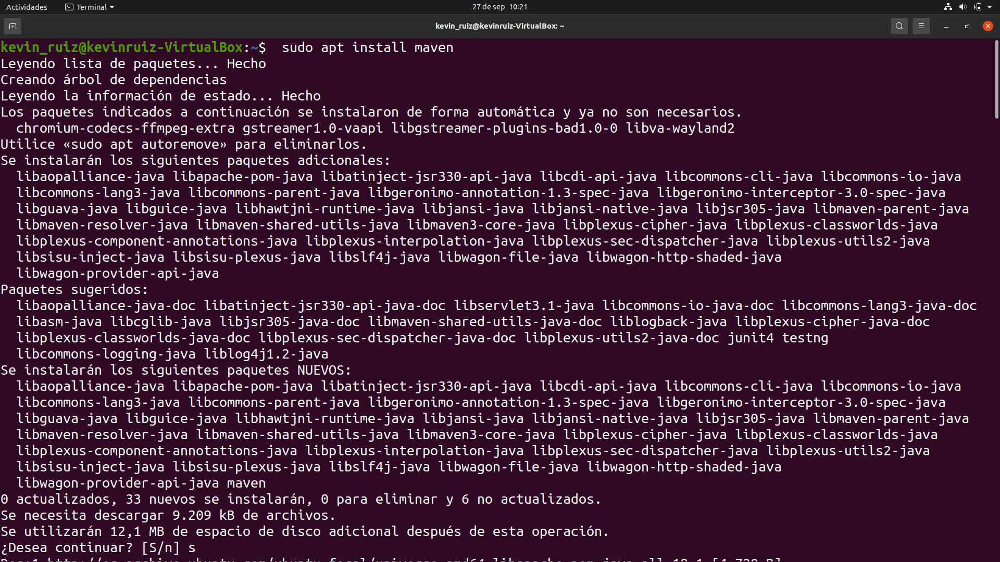
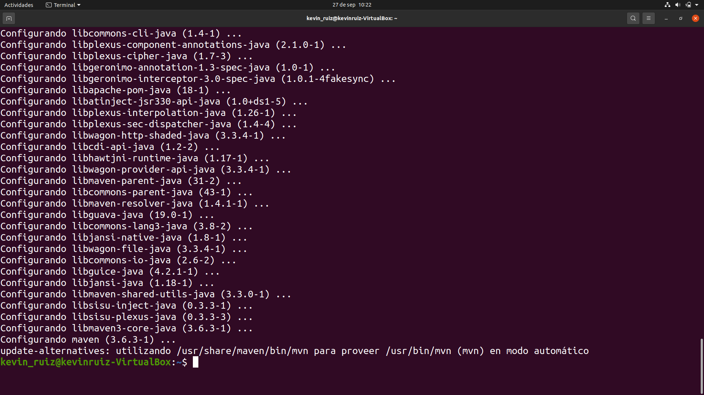
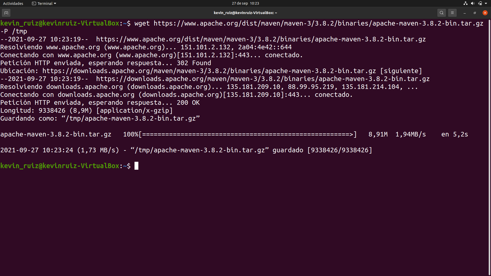
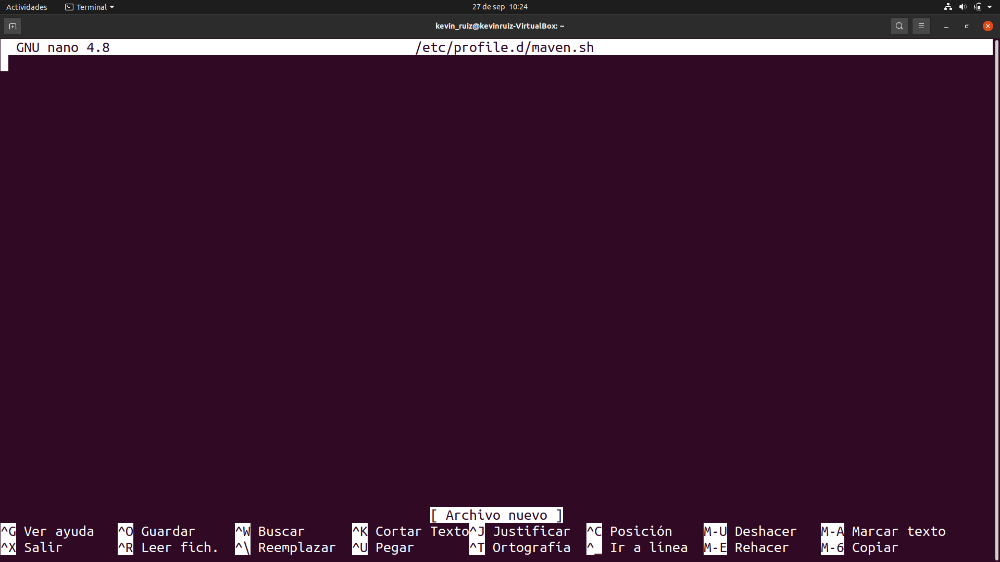

# Maven

## Índice
* [Introducción](#introducción)  
<a name="introducción"/>

* [Requisitos](#requisitos)  
<a name="requisitos"/>

* [Apache Maven](#apache-maven)  
<a name="apache-maven"/>

* [Instalación](#instalación)  
<a name="instalación"/>

* [Instalar versión específica](#instalar-versión-específica)  
<a name="instalar-versión-específica"/>

<div align="justify">

  ## Introducción
  En el día de hoy llevaremos a cabo el proceso de instalación de Apache Maven en un sistema operativo Linux, concretamente en una distribución Ubuntu 20.04.
  
  El objetivo de este proyecto es mostrar los pasos a seguir para realizar la correcta instalación de esta herramienta tan útil para desarrolladores de Java.
  
  ## Requisitos
  Como hemos dicho, este ejemplo se llevará a cabo en la distribución de Linux, Ubuntu 20.04. Podemos hacer uso de un ordenador con este sistema operativo o, como es mi 
  caso, utilizar una máquina virtual. En este caso, yo estoy usando un portátil con Windows 10 instalado y mediante el uso de la aplicación “VirtualBox”, me encuentro 
  virtualizando dicho sistema operativo.
  
  Necesitaremos tener instalado el JDK, esto se puede comprobar ejecutando el comando:
  
    java -version 
  
  En nuestra terminal. Y en caso de tenerlo, les aparecerá este mensaje en pantalla:
  
   

  Como se puede apreciar, yo poseo la versión 8.
  
  También necesitaremos conexión a internet.
  
  Si cumplimos con todos los puntos anteriores, ya estamos listos para poder empezar con la instalación.
  
  ## Apache Maven
  Antes de comenzar el proceso, un poco de contexto para entender mejor la herramienta que estamos a punto de instalar.
  
  Maven es una herramienta de software para la gestión y construcción de proyectos Java creada alrededor del año 2002. Es una de las herramientas más útiles a la hora de 
  utilizar librerías de terceros. Puede realizar tareas como la compilación de código y su empaquetado. 
  
  Principalmente, su característica más importante, es su capacidad de trabajar en red. Cuando definimos las dependencias de Maven, estas serán guardades en un repositorio en 
  la nube llamado Maven Central.
  
  Es por esto, y otras características, que, desde hace ya bastantes años, esta herramienta se ha convertido en una necesidad primordial para cualquier desarrollador de Java.
  
  Ahora que tenemos un poco de contexto, procedamos a la instalación en sí.
  
  ## Instalación
  El primer paso, será confirmar que no tengamos alguna versión de esta herramienta ya instalada en nuestro equipo. 
  
  Para esto, será tan sencillo como teclear en nuestra terminal el comando: 
  
    mvn -version
  
  En caso de no tenerla, nos aparecerá un mensaje como este:
  
  
  
  Existen varios métodos para realizar la instalación, en este caso, lo haremos desde nuestra terminal. En mi opinión, esta es la forma más simple y directa.
  
  Comenzaremos actualizando nuestro equipo usando el comando:
  
    sudo apt update
  
  Luego de introducir nuestra contraseña, la instalación comenzará automáticamente:
  
  
  
  En cierto punto, nos hará confirmar que deseamos descargar cierta cantidad de archivos y que esto ocupará espacio de nuestro disco. 
  
  Bastará con teclear una “s”, indicando que sí queremos continuar y el proceso seguirá hasta concluir.
  
  
  
  Cuando lleguemos a este punto, ya tendremos instalado Maven en nuestro equipo. Para confirmarlo, será tan sencillo como insertar el comando que usamos al principio
  
    mvn -version
  
  

  Y, efectivamente, se puede apreciar que tenemos la versión 3.6.3 correctamente instalada.
  
  ## Instalar versión específica
  Como hemos visto en el caso anterior, hemos instalado la versión 3.6.3. Sin embargo, existe la posibilidad de que nos interese otra versión.
  
  Podemos solucionar esto descargando una versión específica. Veamos cómo sería esto.
  
  En mi caso, en este ejemplo instalaré la versión 3.8.2. La cual es la última disponible en el momento que escribo este documento. Se puede visitar la página de Apache Maven 
  para consultar cual es la más reciente.
  
  Comenzaremos descargando Maven en el directorio /tmp, insertando en nuestra terminal lo siguiente:
  
  	wget https://www.apache.org/dist/maven/maven-3/3.8.2/binaries/apache-maven-3.8.2-bin.tar.gz -P /tmp
  
  Inmediatamente empezará la descarga. Se vería así:
  
  
  
  En el momento que termine la descarga, extraeremos el archivo al directorio /opt de la siguiente forma:
  
  	sudo tar xf /tmp/apache-maven-*.tar.gz -C /opt
  
  Y, además, crearemos un enlace simbólico que apunte al directorio de instalación de Maven:
  
  	sudo ln -s /opt/apache-maven-3.8.2 /opt/maven
  
  Haciendo esto, cuando salga una nueva versión, podremos actualizar Maven desempaquetando esta última versión y cambiando el enlace simbólico para señalar a la nueva.
  
  El siguiente paso es establecer las variables de entorno, esto es un proceso sencillo.
  
  En primer lugar, usaremos un editor de texto, que, en este caso, usaré Nano, el cual viene por defecto en Ubuntu 20.04. Es un editor muy simple, pero para este paso no 
  necesitamos mucho más.
  
  Lo abriremos y además crearemos un nuevo archivo para Maven, insertando lo siguiente:
  
  	sudo nano /etc/profile.d/maven.sh
  
  Si todo va bien, se nos debería abrir el editor y el nombre del archivo que acabamos de crear aparecerá arriba de esta forma:
  
  
  
  A continuación, copiaremos el siguiente código:
 
  ```
  export JAVA_HOME=/usr/lib/jvm/ (version de java correspondiente)
  export M2_HOME=/opt/maven
  export MAVEN_HOME=/opt/maven
  export PATH=${M2_HOME}/bin:${PATH}
  ```
  
  En la parte entre paréntesis, como se indica, se debe sustituir por la versión de Java que tengamos en nuestro equipo. En mi caso, como vimos al principio de este 
  documento, recordamos que era la versión 8. 
  
  Por lo tanto, en mi caso se debería ver de la siguiente forma:
  
  
  
  Guardamos y cerramos el archivo cuando hayamos completado lo anterior y ahora hacemos los siguientes pasos.
  
  Primero, haremos que el script sea ejecutable con chmod de la siguiente forma:
  
  	sudo chmod +x /etc/profile.d/maven.sh
  
  Segundo, cargamos las variables de entorno con:
  
  	source /etc/profile.d/maven.sh
  
  Finalmente, introduciremos una vez más la orden:
  
    mvn -version
  
  Y si aparece lo siguiente:
  
  
  
  Podremos dar por terminado el proceso, pues, como se puede apreciar, tenemos correctamente instalada la versión 3.8.2.
  
 </div>
