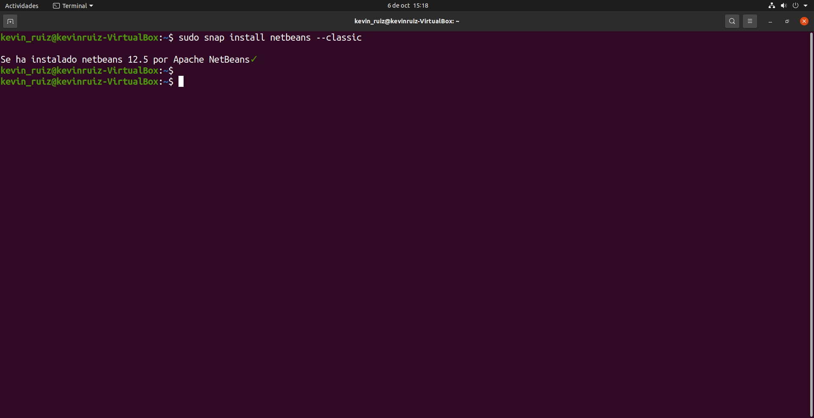
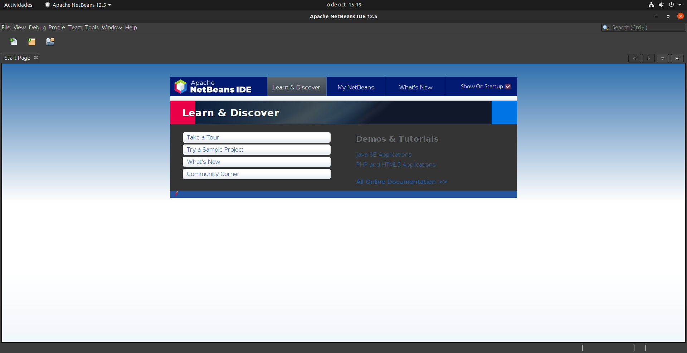

# NetBeans-12

## Índice
* [Introducción](#introducción)  
<a name="introducción"/>

* [Requisitos](#requisitos)  
<a name="requisitos"/>

* [Instalación](#instalación)  
<a name="instalación"/>

* [Ejecución](#ejecución)  
<a name="ejecución"/>

* [Eliminación](#eliminación)  
<a name="eliminación"/>

  ## Introducción
  En el día de hoy, llevaremos a cabo la instalación del IDE NetBeans en su versión 12.
  
  Este es uno de los entornos de desarrollo más popular para quienes trabajan con el lenguaje de programación Java.
  
  En este proyecto se explicarán los pasos necesarios para realizar la instalación en un sistema operativo Linux, concretamente en la distribución Ubuntu, en su versión 
  20.04.
  
  ## Requisitos
  En primer lugar, como se ha dicho en el punto anterior, este tutorial será enfocado a la distribución de Linux, Ubuntu. Por lo que, aunque es posible la instalación en 
  otros sistemas operativos como Windows o macOS, los pasos serán distintos a los realizados en este proyecto.
  
  En mi caso, estoy utilizando la aplicación “Virtualbox” para virtualizar Ubuntu en una máquina virtual. Los pasos son exactamente los mismos que si dicho sistema operativo 
  estuviera instalado de forma nativa en el equipo.
  
  Necesitaremos también una conexión a internet para poder realizar las descargas.
  
  Finalmente, será necesario tener instalado Java en nuestro equipo.
  
  Podemos comprobar esto último introduciendo un simple comando en nuestra terminal: 
  
    java -version
  
  Debería aparecer algo parecido a lo siguiente:
  
  
  
  Como se puede apreciar, yo tengo instalada la versión 8 del JDK, lo cual significa “Java Developer Kit” o kit de desarrollo de Java. Por lo que, podemos comenzar con la 
  instalación.
  
  ## Instalación
  El proceso de instalación es bastante sencillo. La forma más eficiente es mediante los paquetes Snap.
  
  Estos son paquetes de software que contienen todas las dependencias que necesitan para funcionar correctamente.
  
  ¿Por qué digo que son los más eficientes? Por varias razones:
  
  * Son más rápidos de instalar.
  * Más fáciles de crear.
  * Más seguros desde el punto de vista de la ejecución.
  * Se actualizan automáticamente.
  
  Ahora que tenemos claro las ventajas de estos paquetes, ¿cómo se utilizan?
  
  Muy sencillo, basta con introducir en nuestra terminal el siguiente comando:
    
    sudo snap install netbeans --classic
  
  Ahora nos pedirá nuestra contraseña y al momento de introducirla, comenzará la instalación de NetBeans.
  
  Cuando finalice el proceso se verá así:
  
  
  
  Así de sencillo, ya tenemos instalado NetBeans en su versión 12.5, en este caso. 
  
  ## Ejecución
  Ahora que disponemos de este programa, solo tenemos que buscarlo entre nuestros programas o aún más rápido, simplemente teclear “netbeans” en nuestra terminal y 
  automáticamente se nos abrirá.
  
  
  
  Aquí podemos ver su interfaz de presentación. En este punto ya estamos listos para comenzar a trabajar con él.
  
  ## Eliminación
  En el caso de que queramos deshacernos de este programa, el proceso también es bastante sencillo.
  
  Simplemente debemos introducir el comando
    
    sudo snap remove netbeans
  
  Y, de esta forma, eliminaremos completamente dicho software de nuestro equipo.
  
 

