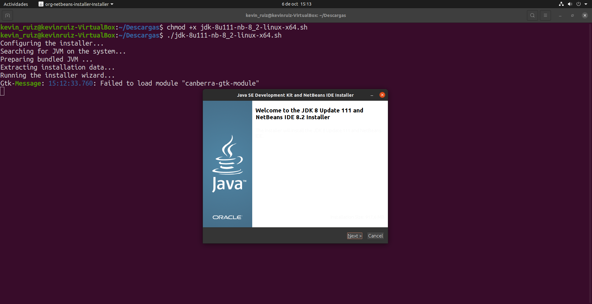
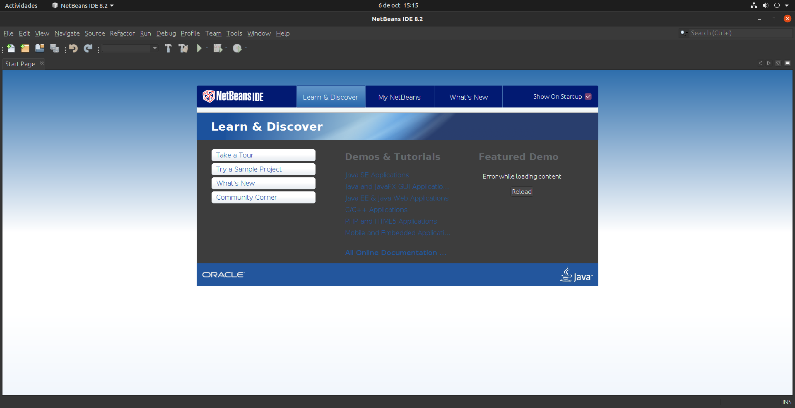

# NetBeans-8

## Índice
* [Introducción](#introducción)  
<a name="introducción"/>

* [Requisitos](#requisitos)  
<a name="requisitos"/>

* [Instalación](#instalación)  
<a name="instalación"/>

* [Ejecución](#ejecución)  
<a name="ejecución"/>

  ## Introducción
  En el día de hoy, llevaremos a cabo la instalación del IDE NetBeans en su versión 12.
  
  Este es uno de los entornos de desarrollo más popular para quienes trabajan con el lenguaje de programación Java.
  
  En este proyecto se explicarán los pasos necesarios para realizar la instalación en un sistema operativo Linux, concretamente en la distribución Ubuntu, en su versión 
  20.04.
  
  ## Requisitos
  En primer lugar, como se ha dicho en el punto anterior, este tutorial será enfocado a la distribución de Linux, Ubuntu. Por lo que, aunque es posible la instalación en 
  otros sistemas operativos como Windows o macOS, los pasos serán distintos a los realizados en este proyecto.
  
  En mi caso, estoy utilizando la aplicación “Virtualbox” para virtualizar Ubuntu en una máquina virtual. Los pasos son exactamente los mismos que si dicho sistema operativo 
  estuviera instalado de forma nativa en el equipo.
  
  Necesitaremos también una conexión a internet para poder realizar las descargas.
  
  Finalmente, será necesario tener instalado Java en nuestro equipo.
  
  Podemos comprobar esto último introduciendo un simple comando en nuestra terminal: 
  
    java -version
  
  Debería aparecer algo parecido a lo siguiente:
  
  
  
  Como se puede apreciar, yo tengo instalada la versión 8 del JDK, lo cual significa “Java Developer Kit” o kit de desarrollo de Java. Por lo que, podemos comenzar con la 
  instalación.
  
  ## Instalación
  El primer paso, será ir a la página de Oracle. Podemos seguir este enlace: 
  
    https://www.oracle.com/technetwork/java/javase/downloads/jdk-netbeans-jsp-3413139-esa.html
  
  Una vez aquí descargaremos la versión para Linux x64. Aparece con el siguiente nombre: “jdk-8u111-nb-8_2-linux-x64.sh”.
  
  Debemos aceptar los términos del acuerdo de licencia para que nos permita iniciar la descarga.
  
  Una vez realizado esto, el resto de pasos serán desde la línea de comandos.
  
  Abriremos nuestra terminal, navegaremos hasta el directorio donde realizamos la anterior descarga.  Recuerdos algunos comandos básicos para navegar en el terminal: “cd” 
  para cambiar de directorio y “ls” para listar lo que se encuentra dentro de ese directorio.
  
  En mi caso, hice la descarga en la carpeta “Descargas”, por lo que navegaré hasta la misma de la siguiente forma:
  
  
  
  Ahora que estamos en dicho directorio, el siguiente paso será hacer ejecutable el script del instalador de NetBeans. 
  
  Para esto debemos introducir esta secuencia de comandos: 
  
    chmod +x jdk-8u111-nb-8_2-linux-x64.sh
    ./jdk-8u111-nb-8_2-linux-x64.sh
  
  Una vez hecho esto, nos pedirá nuestra contraseña, y una vez introducida, nos aparecerá la página de bienvenida del instalador.
  
  
  
  A partir de aquí el proceso es muy sencillo.
  
  Leeremos y aceptaremos los términos del acuerdo de licencia.
  
  Seguiremos los pasos tal y como nos indica el instalador, seleccionando el lugar donde queremos instalar la aplicación y demás. También es recomendable marcar la opción de 
  actualizaciones automáticas.
  
  Una vez llegados al final, pulsaremos en instalar y cuando este termine, tendremos NetBeans en su versión 8 disponible en nuestro ordenador.
  
  ## Ejecución
  En último lugar, para comprobar que todo ha ido de manera correcta, ejecutaremos el programa:
  
  
  
  Como podemos ver, al abrir el programa, me aparece la página de inicio. Por lo tanto, ya estamos listos para empezar a trabajar con él.
 

