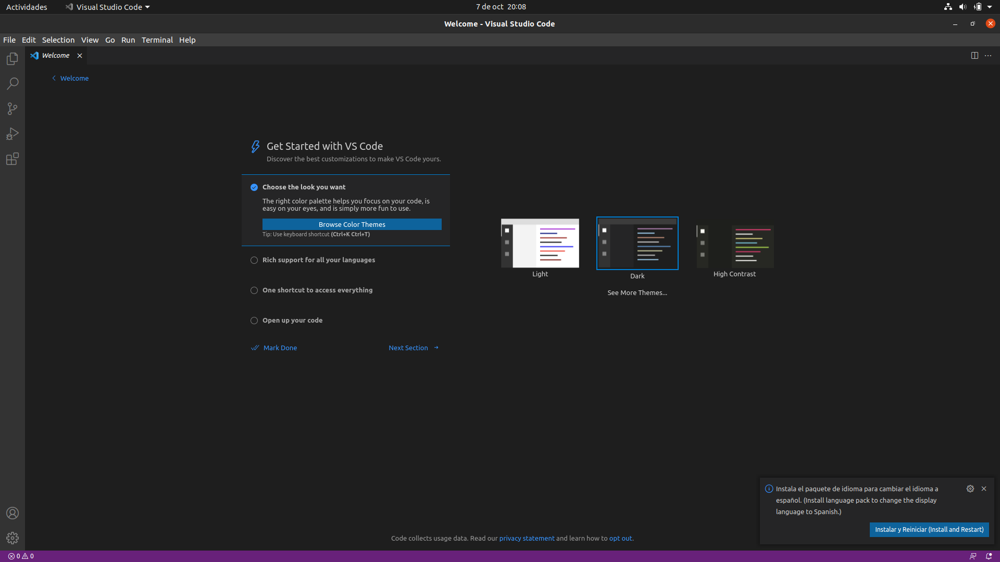

# Visual Studio Code

## Índice
* [Introducción](#introducción)  
<a name="introducción"/>

* [Requisitos](#requisitos)  
<a name="requisitos"/>

* [Instalación](#instalación)  
<a name="instalación"/>

* [Ejecución](#ejecución)  
<a name="ejecución"/>

* [Extensiones](#extensiones)  
<a name="extensiones"/>

  ## Introducción
  En el día de hoy, llevaremos a cabo la instalación del IDE Visual Studio Code.
  
  Este es un entorno de desarrollo integrado desarrollado por Microsoft y, a día de hoy, es una de las principales opciones para desarrolladores de todo el mundo. 
  
  En este proyecto se explicarán los pasos necesarios para realizar la instalación en un sistema operativo Linux, concretamente en la distribución Ubuntu, en su versión 
  20.04.
  
  ## Requisitos
  En primer lugar, como se ha dicho en el punto anterior, este tutorial será enfocado a la distribución de Linux, Ubuntu. Por lo que, aunque es posible la instalación en 
  otros sistemas operativos como Windows o macOS, los pasos serán distintos a los realizados en este proyecto.
  
  En mi caso, estoy utilizando la aplicación “Virtualbox” para virtualizar Ubuntu en una máquina virtual. Los pasos son exactamente los mismos que si dicho sistema operativo 
  estuviera instalado de forma nativa en el equipo.
  
  Necesitaremos también una conexión a internet para poder realizar las descargas.
  
  Finalmente, será necesario tener instalado Java en nuestro equipo.
  
  Podemos comprobar esto último introduciendo un simple comando en nuestra terminal: 
  
    java -version
  
  Debería aparecer algo parecido a lo siguiente:
  
  
  
  Como se puede apreciar, yo tengo instalada la versión 8 del JDK, lo cual significa “Java Developer Kit” o kit de desarrollo de Java. Por lo que, podemos comenzar con la 
  instalación.
  
  ## Instalación
  La instalación de este IDE es un proceso muy sencillo y muy directo si hacemos uso de los paquetes Snap. Los cuales ya hemos comentado en proyectos anteriores. 
  
  Recordemos algunas de sus ventajas:
  
  * Son más rápidos de instalar.
  * Más fáciles de crear.
  * Más seguros desde el punto de vista de la ejecución.
  * Se actualizan automáticamente.
  
  Para empezar el proceso, será tan sencillo como ir a nuestra terminal, e introducir lo siguiente: 
  
    sudo snap install --classic code
  
  A continuación, introduciremos nuestra contraseña cuando nos la solicite y automáticamente comenzará con la descarga:
  
  
  
  Esperaremos unos minutos hasta que termine el proceso y, una vez finalizado, ya tendremos instalado Visual Studio Code en nuestro equipo.
  
  ## Ejecución
  Comprobemos que todo ha marchado correctamente abriendo ahora el programa.
  
  
  
  Efectivamente, se ha realizado la instalación sin ningún problema y podemos ver la página de inicio. 
  
  ## Extensiones
  Una de las características que hacen a Visual Studio Code tan potente, es la cantidad de extensiones que podemos añadirle.
  
  Para añadir extensiones es tan sencillo como ir a la última opción que nos aparece al lado izquierdo, escribir el nombre de la extensión que queremos y clicar en el botón 
  de “install”.
  
  Por ejemplo, en mi caso, una de las extensiones que voy a instalar es “Java extension pack” esta incluye varias herramientas que nos permite añadir soporte para el lenguaje 
  Java.
  
  
  
  Otras extensiones que podrían ser muy interesantes, independientemente del lenguaje y el tipo de desarrollo que se realice, son:
  
  * Visual Studio IntelliCode.
  * Path Intellisense.
  * Bracket Pair Colorizer.
  * GitLens.
  * Prettier.
  * Color Highlight.
  * Indent Rainbow.
  
  Además, también existe la posibilidad de cambiar el idioma a español mediante la extensión de idioma. Si tienes configurado el sistema operativo en español, normalmente el 
  propio programa te lo sugerirá al iniciar, como se puede apreciar en la imagen del apartado anterior.

 

