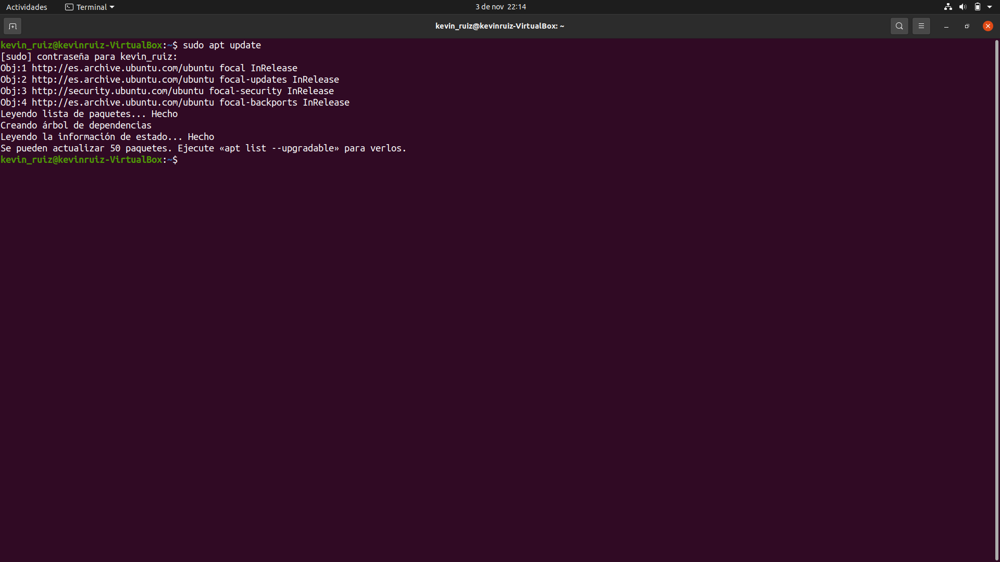
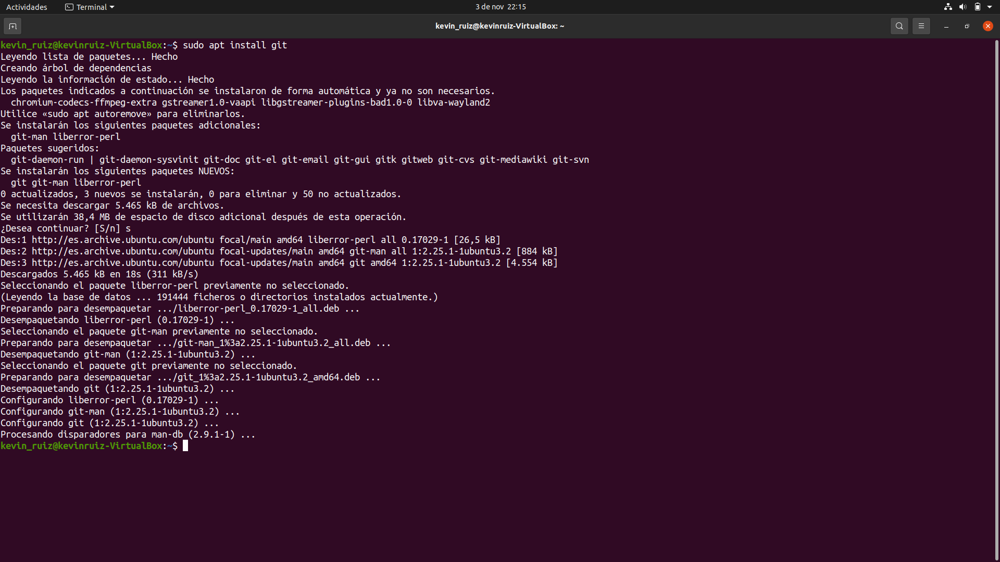
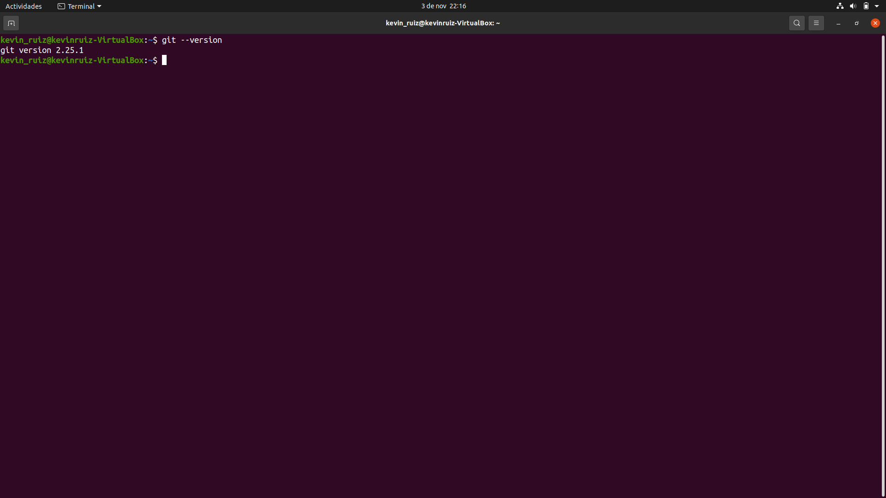
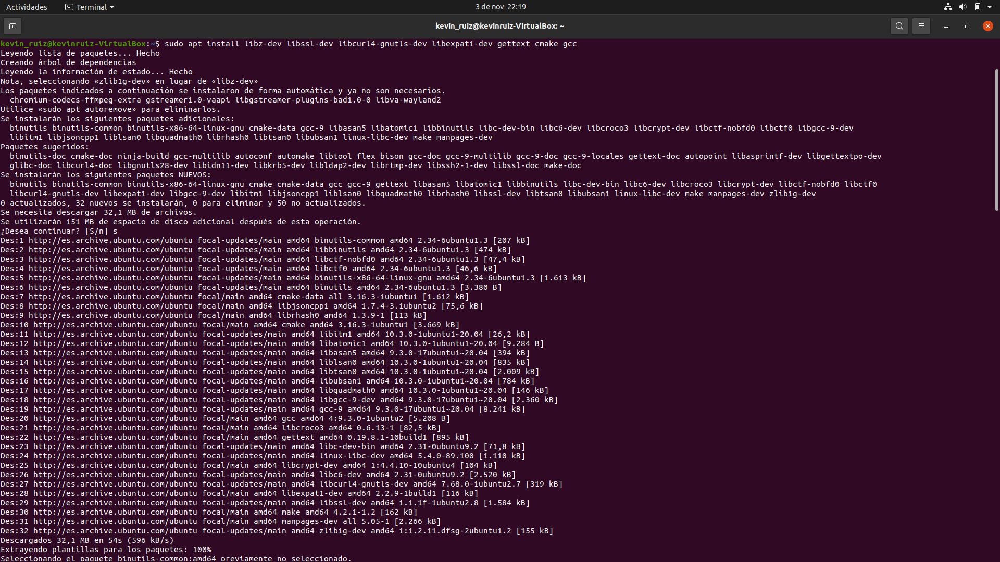
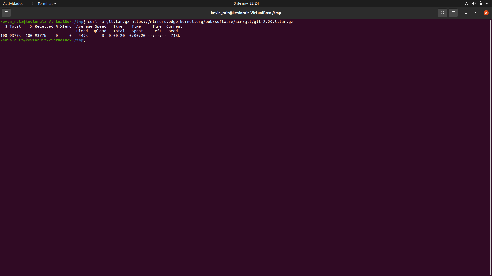
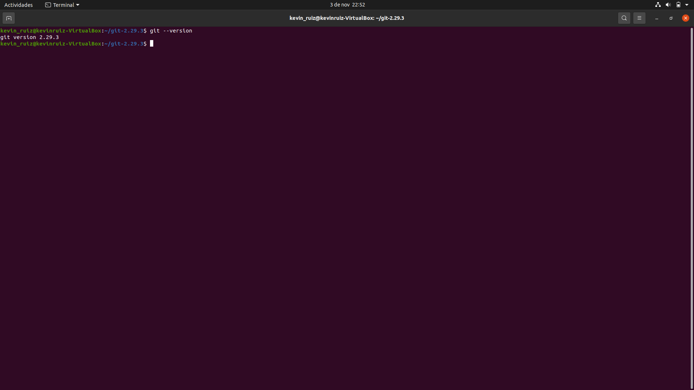
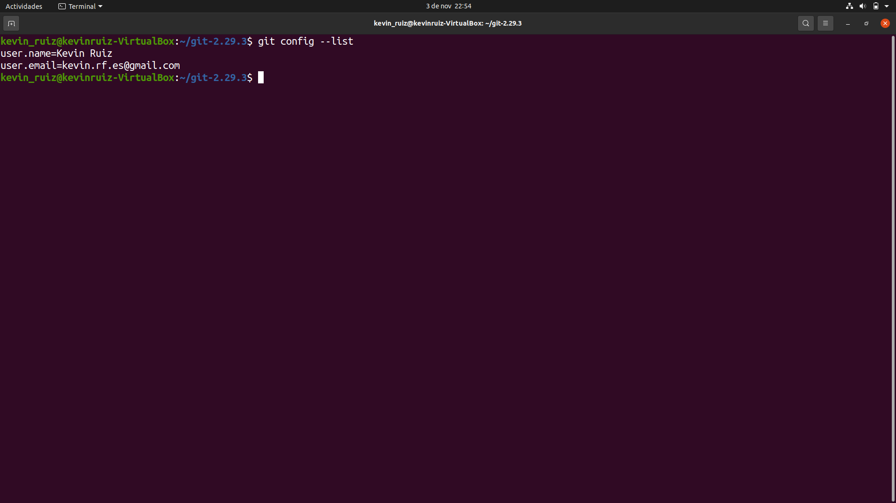

# Instalación Git

## Índice
* [Introducción](#introducción)  
<a name="introducción"/>

* [Requisitos](#requisitos)  
<a name="requisitos"/>

* [Instalación](#instalación)  
<a name="instalación"/>

* [Versión específica](#versión-específica)  
<a name="versión-específica"/>

* [Configuración](#configuración)  
<a name="configuración"/>

  ## Introducción
  En el día de hoy, llevaremos a cabo la instalación de Git.
  
  Este es un sistema de control de versiones utilizado a nivel mundial por empresas y desarrolladores de diversos ámbitos.
  
  En este proyecto se explicarán los pasos necesarios para realizar la instalación en un sistema operativo Linux, concretamente en la distribución Ubuntu, en su versión 20.04.
  
  ## Requisitos
  En primer lugar, como se ha dicho en el punto anterior, este tutorial será enfocado a la distribución de Linux, Ubuntu. Por lo que, aunque es posible la instalación en otros sistemas operativos como Windows o macOS, los pasos serán distintos a los realizados en este proyecto.
  
  En mi caso, estoy utilizando la aplicación “Virtualbox” para virtualizar Ubuntu en una máquina virtual. Los pasos son exactamente los mismos que si dicho sistema operativo estuviera instalado de forma nativa en el equipo.
  
  Necesitaremos también una conexión a internet para poder realizar las descargas.
  
  ## Instalación
  En primer lugar, nos aseguraremos de no tener ya instalado Git en nuestro equipo. Para eso utilizaremos el comando:
  
    git --version
  
  En caso negativo, el proceso es muy sencillo mediante el uso de paquetes. 
  
  Para empezar, utilizaremos el comando “sudo apt update” en nuestra terminal, para actualizar el índice de paquetes de nuestro equipo. Se nos solicitará la contraseña y el proceso comenzará directamente.
  
   
  
  Cuando termine, introduciremos la siguiente instrucción “sudo apt install git” y comenzará la instalación de Git.
  
   
  
  Finalmente, volveremos a usar el comando anterior:
  
    git --version 
  
  Y debería verse el siguiente output:
  
   
  
  ¡Listo! Ya tenemos Git instalado en nuestro Ubuntu.
  
  ## Versión específica
  Otra opción de la que disponemos es realizar nosotros manualmente la instalación desde la fuente, eligiendo la versión que deseamos. 
  
  Para ello en primer lugar, instalamos el software necesario para Git, introduciendo en la terminal lo siguiente: 
  
    sudo apt install libz-dev libssl-dev libcurl4-gnutls-dev libexpat1-dev gettext cmake gcc
  
  Al momento de introducirlo comenzarán a instalarse las dependencias necesarias:
  
   
  
  A continuación, crearemos un directorio temporal para descargar aquí nuestro tarball de Git. Los pasos para realizar esto son tan sencillos como introducir los comandos:ç
  
    mkdir tmp
  
  Para crear el directorio, y luego: 
  
    cd /tmp 
  
  Para movernos a él.
  
  Una vez aquí, el siguiente paso será descargar el citado tarball. En este caso, descargaremos la versión 2.29.3.
  
  Si se desea otra versión, se pueden consultar en la página: 
  
    https://mirrors.edge.kernel.org/pub/software/scm/git/
  
  Para realizar la descargar, introduciremos lo siguiente: 
  
    curl -o git.tar.gz https://mirrors.edge.kernel.org/pub/software/scm/git/git-2.29.3.tar.gz
  
  Automáticamente empezará la descarga:
  
  
  
  Seguidamente, descomprimiremos el archivo con el comando: 
  
    tar -zxf git.tar.gz
  
  Y nos trasladaremos al nuevo directorio de Git, con:
  
    cd git-*
  
  En este punto, crearemos el paquete y lo instalaremos con los comandos:
  
    make prefix=/usr/local all
    sudo make prefix=/usr/local install
  
  Cuando finalice la instalación, introduciremos el comando:
  
    exec bash
  
  Para utilizar la versión de Git que acabamos de instalar.
  
  Finalmente, comprobamos nuestra versión de Git con el comando que ya conocemos: 
  
    git --version
  
  Y debería verse lo siguiente: 
  
  
  
  ## Configuración
  El último paso será configurar Git con nuestra información. 
  
  Será tan sencillo como utilizar las siguientes instrucciones:
  
    git config --global user.name "Su nombre"
    git config --global user.email "Su correo electrónico"
  
  Una vez hecho esto, con el comando:
  
    git config --list
  
  Podrá ver la información que ha establecido y comprobar que esta es correcta.
  
  En mi caso es la siguiente: 
  
  

