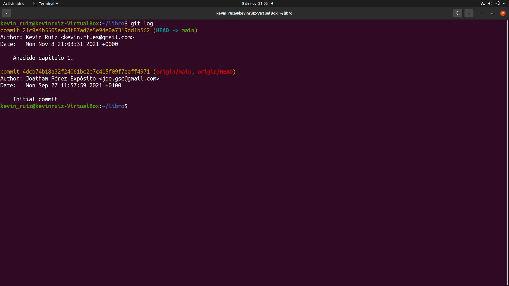
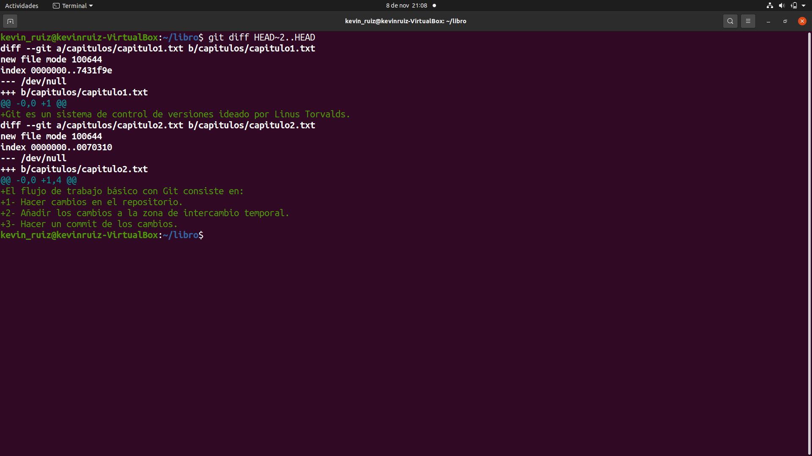
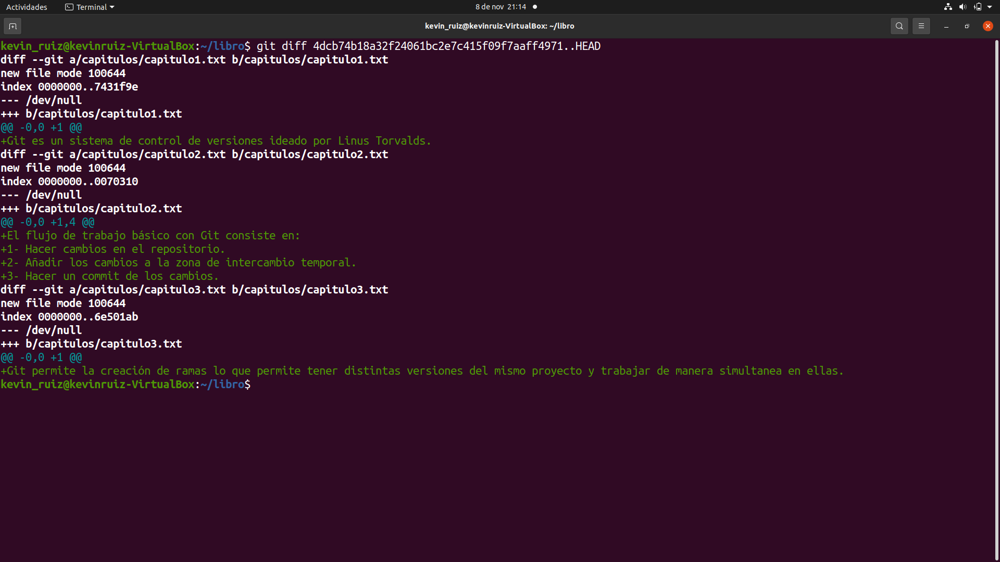
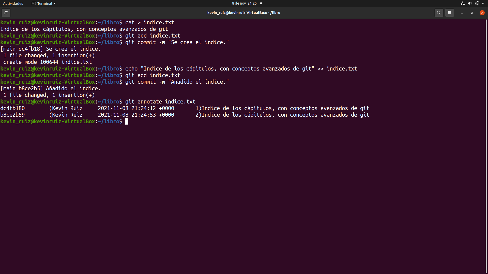
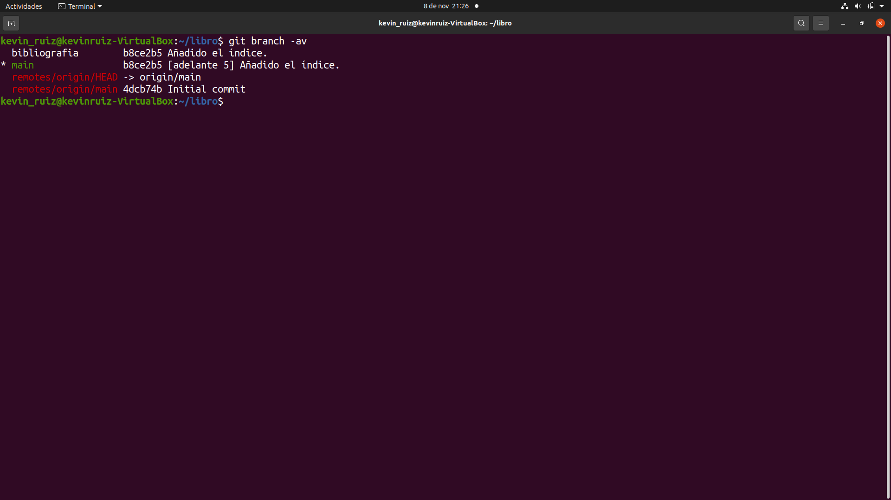
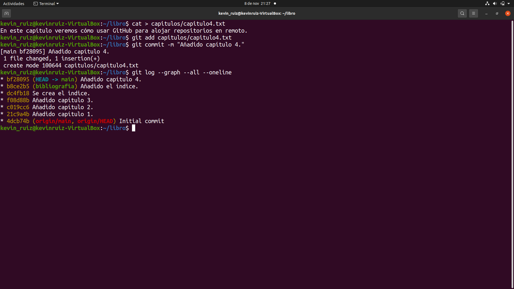
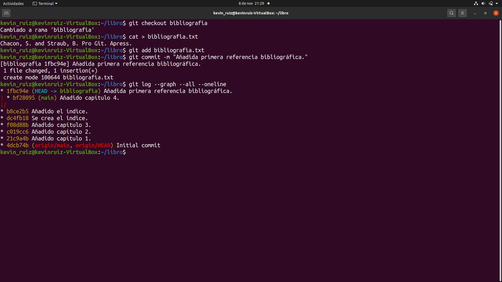
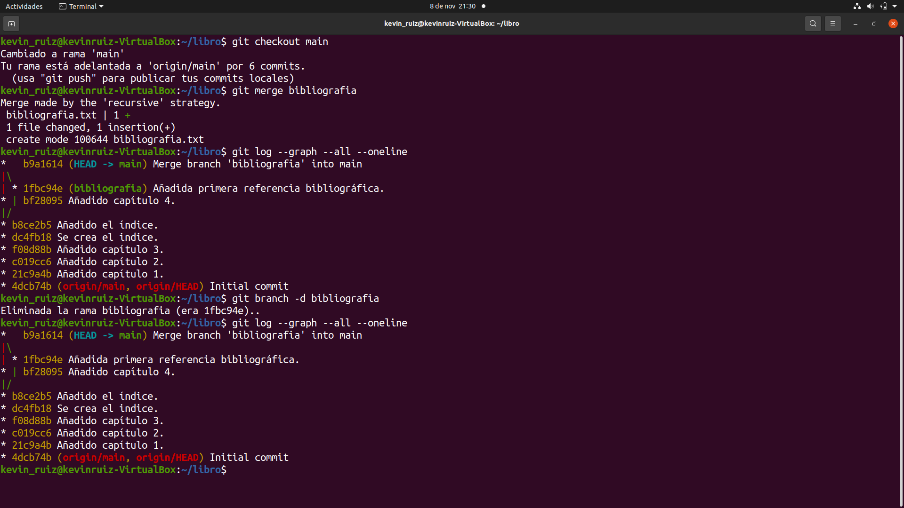
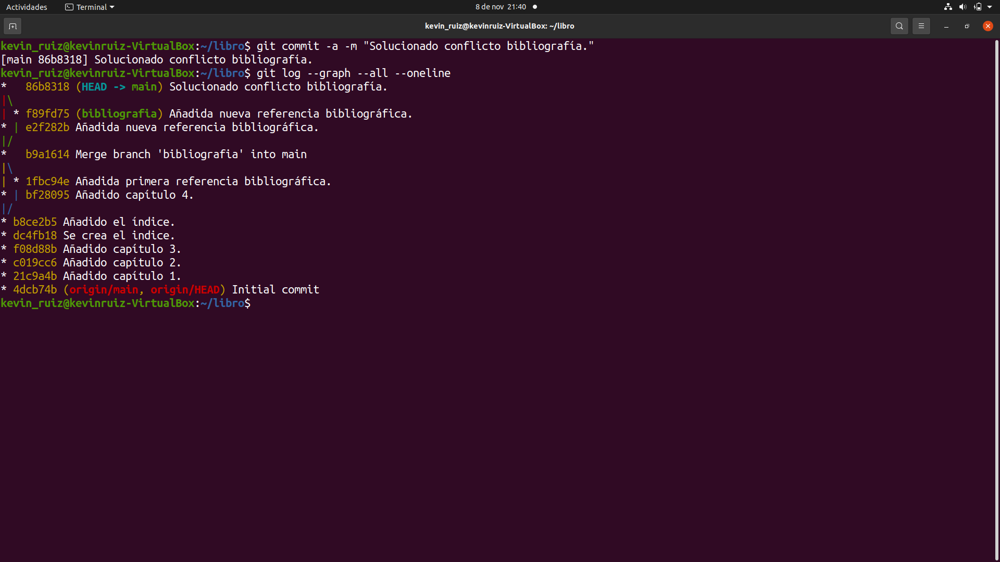

# 
Manipulación Avanzada en Git

## Índice
* [Introducción](#introducción)  
<a name="introducción"/>

* [Ejercicio 1](#ejercicio-1)  
<a name="ejercicio-1"/>

* [Ejercicio 2](#ejercicio-2)  
<a name="ejercicio-2"/>

* [Ejercicio 3](#ejercicio-3)  
<a name="ejercicio-3"/>

* [Ejercicio 4](#ejercicio-4)  
<a name="ejercicio-4"/>

* [Ejercicio 5](#ejercicio-5)  
<a name="ejercicio-5"/>

* [Ejercicio 6](#ejercicio-6)  
<a name="ejercicio-6"/>

* [Ejercicio 7](#ejercicio-7)  
<a name="ejercicio-7"/>

* [Ejercicio 8](#ejercicio-8)  
<a name="ejercicio-8"/>

* [Ejercicio 9](#ejercicio-9)  
<a name="ejercicio-9"/>

  ## Introducción
  En este proyecto, se avanzará en los trabajos anteriores y se comenzará a trabajar con Git a un nivel más avanzado.
  
  A lo largo de distintos ejercicios aprenderemos nuevos comandos de Git y reforzaremos los ya aprendidos.
  
  ## Ejercicio 1
  Requisitos:
  
  * Mostrar el historial de cambios del repositorio.
  
  * Crear la carpeta capítulos y crear dentro de ella el fichero capitulo1.txt con el siguiente texto:
  
    Git es un sistema de control de versiones ideado por Linus Torvalds.
  
  * Añadir los cambios a la zona de intercambio temporal.
  
  * Hacer un commit de los cambios con el mensaje
  
    Añadido capítulo 1.
  
  * Volver a mostrar el historial de cambios del repositorio.
  
  Solución:
  
  1. 
  
    git log
  
  2.
  
    mkdir capitulos
  
  3. 
  
    cat > capitulos/capitulo1.txt
    Git es un sistema de control de versiones ideado por Linus Torvalds.
  
  4.
  
    Ctrl+D
  
  5.
  
    git add capitulos/capitulo1.txt
  
  6. 
  
    git commit -m "Añadido capítulo 1."
  
  7. 
  
    git log
  
  El resultado final se ve de la siguiente forma:
  
  
  
  ## Ejercicio 2
  Requisitos:
  
  * Crear el fichero capitulo2.txt en la carpeta capítulos con el siguiente texto.
  
    El flujo de trabajo básico con Git consiste en: 
    1- Hacer cambios en el repositorio. 
    2- Añadir los cambios a la zona de intercambio temporal. 
    3- Hacer un commit de los cambios.
  
  * Añadir los cambios a la zona de intercambio temporal.
  
  * Hacer un commit de los cambios con el mensaje 
  
      Añadido capítulo 2.
  
  * Mostrar las diferencias entre la última versión y dos versiones anteriores.

  Solución:
  
  1.
  
    cat > capitulos/capitulo2.txt
    El flujo de trabajo básico con Git consiste en:
    1- Hacer cambios en el repositorio.
    2- Añadir los cambios a la zona de intercambio temporal.
    3- Hacer un commit de los cambios.
  
  2. 
  
     Ctrl+D
  
  3.
  
    git add capitulos/capitulo2.txt
  
  4.
  
    git commit -m "Añadido capítulo 2."
  
  5.
  
    git diff HEAD~2..HEAD
  
  
  
  ## Ejercicio 3
  Requisitos:
  
  * Crear el fichero capitulo3.txt en la carpeta capítulos con el siguiente texto.
  
    Git permite la creación de ramas lo que permite tener distintas versiones del mismo proyecto y trabajar de manera simultánea en ellas.
  
  * Añadir los cambios a la zona de intercambio temporal.
  
  * Hacer un commit de los cambios con el mensaje 
  
    Añadido capítulo 3.
  
  * Mostrar las diferencias entre la primera y la última versión del repositorio.
  
  Solución:
  
  1.
  
    cat > capitulos/capitulo3.txt
  
  2. 
  
    Git permite la creación de ramas lo que permite tener distintas versiones del mismo proyecto y trabajar de manera simultánea en ellas.
  
  3.
  
     Ctrl+D
  
  4.
  
     git add capitulos/capitulo3.txt
  
  5.
  
     git commit -m "Añadido capítulo 3."
  
  6. 
  
     git log
  
  7.
  
    git diff (codigo hash de la primera versión)..HEAD
  
  
  
  ## Ejercicio 4
  Requisitos:
  
  * Crea el fichero índice.txt la siguiente línea:
  
    Indice de los cápitulos, con conceptos avanzados de git
  
  * Añadir los cambios a la zona de intercambio temporal.
  
  * Hacer un commit de los cambios con el mensaje 
  
    Indice de los cápitulos, con conceptos avanzados de git.
  
  * Mostrar quién ha hecho cambios sobre el fichero indice.txt.
  
  Solución:
  
  1.
  
    cat > indice.txt
  
  2.
  
    git add .
  
  3.
  
    git commit -m "Se crea el indice."
  
  4.
  
    echo "Indice de los cápitulos, con conceptos avanzados de git" >> indice.txt
  
  5.
  
    git add indice.txt
  
  6.
  
    git commit -m "Añadido el índice ."
  
  7.
  
    git annotate indice.txt
  
  
  
  ## Ejercicio 5
  Requisitos:
  
  * Crear una nueva rama bibliografía y mostrar las ramas del repositorio.
  
  Solución:
  
  1.
  
    git branch bibliografia
  
  2.
  
    git branch -av
  
  
  
  ## Ejercicio 6
  Requisitos:
  
  * Crear el fichero capitulos/capitulo4.txt y añadir el texto siguiente:
  
    En este capítulo veremos cómo usar GitHub para alojar repositorios en remoto.
  
  * Añadir los cambios a la zona de intercambio temporal.
  
  * Hacer un commit con el mensaje 
    
    Añadido capítulo 4.
  
  * Mostrar la historia del repositorio incluyendo todas las ramas.
  
  Solución:
  
  1.
  
    cat > capitulos/capitulo4.txt
    En este capítulo veremos cómo usar GitHub para alojar repositorios en remoto.

  2.
  
    Ctrl+D
  
  3.
  
    git add capitulos/capitulo4.txt
  
  4.
  
    git commit -m "Añadido capítulo 4."
  
  5.
  
    git log --graph --all –oneline
  
  
  
  ## Ejercicio 7
  Requisitos:
  
  * Cambiar a la rama bibliografía.
  
  * Crear el fichero bibliografia.txt y añadir la siguiente referencia:
  
    Chacon, S. and Straub, B. Pro Git. Apress.
  
  * Añadir los cambios a la zona de intercambio temporal.
  
  * Hacer un commit con el mensaje 
  
    Añadida primera referencia bibliográfica.
  
  * Mostrar la historia del repositorio incluyendo todas las ramas.
  
  Solución:
  
  1.
  
    git checkout bibliografia
  
  2. 
  
    cat > bibliografia.txt
    Chacon, S. and Straub, B. Pro Git. Apress.
  
  3. 
  
    Ctrl+D
  
  4.
  
    git add bibliografía
  
  5.
  
    git commit -m "Añadida primera referencia bibliográfica."
  
  6.
  
    git log --graph --all –oneline
  
  
  
  ## Ejercicio 8
  Requisitos:
  
  * Fusionar la rama bibliografía con la rama main.
  
  * Mostrar la historia del repositorio incluyendo todas las ramas.
  
  * Eliminar la rama bibliografía.
  
  * Mostrar de nuevo la historia del repositorio incluyendo todas las ramas.

  Solución:
  
  1.
  
    git checkout main
  
  2. 
  
    git merge bibliografia
  
  3.
  
    git log --graph --all --oneline
  
  4.
  
    git branch -d bibliografia
  
  5.
  
    git log --graph --all –oneline
  
  
  
  ## Ejercicio 9
  Requisitos:
  
  * Crear la rama bibliografía.
  
  * Cambiar a la rama bibliografía.
  
  * Cambiar el fichero bibliografia.txt para que contenga las siguientes referencias:
  
    Scott Chacon and Ben Straub. Pro Git. Apress.
    Ryan Hodson. Ry’s Git Tutorial. Smashwords (2014)
  
  * Cambiar a la rama main.
  
  * Cambiar el fichero bibliografia.txt para que contenga las siguientes referencias:
  
    Chacon, S. and Straub, B. Pro Git. Apress.
    Loeliger, J. and McCullough, M. Version control with Git. O’Reilly.

  * Añadir los cambios a la zona de intercambio temporal y hacer un commit con el mensaje 
  
    Añadida nueva referencia bibliográfica.
  
  * Fusionar la rama bibliografía con la rama main.
  
  * Resolver el conflicto dejando el fichero bibliografia.txt con las referencias:
  
    Chacon, S. and Straub, B. Pro Git. Apress.
    Loeliger, J. and McCullough, M. Version control with Git. O’Reilly.
    Hodson, R. Ry’s Git Tutorial. Smashwords (2014)

  * Añadir los cambios a la zona de intercambio temporal y hacer un commit con el mensaje
  
    Resuelto conflicto de bibliografía.
  
  * Mostrar la historia del repositorio incluyendo todas las ramas.
  
  Solución:
  
  1.
  
    git branch bibliografia
  
  2.
  
    git checkout bibliografia
  
  3.
  
    cat > bibliografia.txt
    Scott Chacon and Ben Straub. Pro Git. Apress.
    Ryan Hodson. Ry's Git Tutorial. Smashwords (2014)

  4.
  
    Ctrl+D
  
  5.
  
    git commit -a -m "Añadida nueva referencia bibliográfica."
  
  6.
  
    git checkout main
  
  7.
  
    cat > bibliografia.txt
    Chacon, S. and Straub, B. Pro Git. Apress.
    Loeliger, J. and McCullough, M. Version control with Git. O'Reilly.

  8.
  
    Ctrl+D
  
  9. 
  
    git commit -a -m "Añadida nueva referencia bibliográfica."
  
  10.
  
    git merge bibliografia
  
  11.
  
    git nano bibliografia
    Chacon, S. and Straub, B. Pro Git. Apress.
    Loeliger, J. and McCullough, M. Version control with Git. O’Reilly.
    Hodson, R. Ry’s Git Tutorial. Smashwords (2014)

  12.
  
    git commit -a -m "Solucionado conflicto bibliografía."
  
  13.
  
    git log --graph --all –oneline
  
  
  

