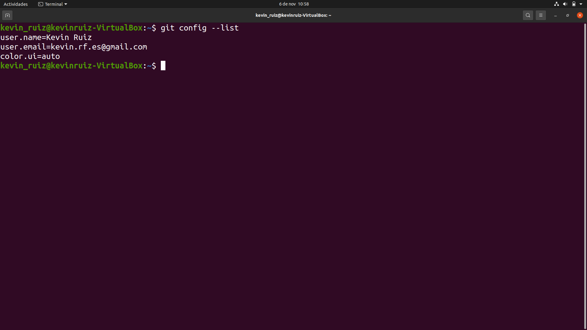
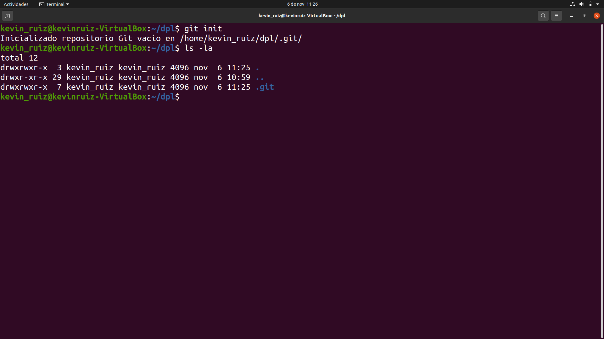
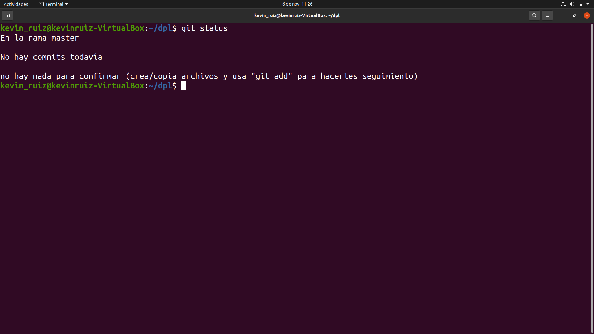
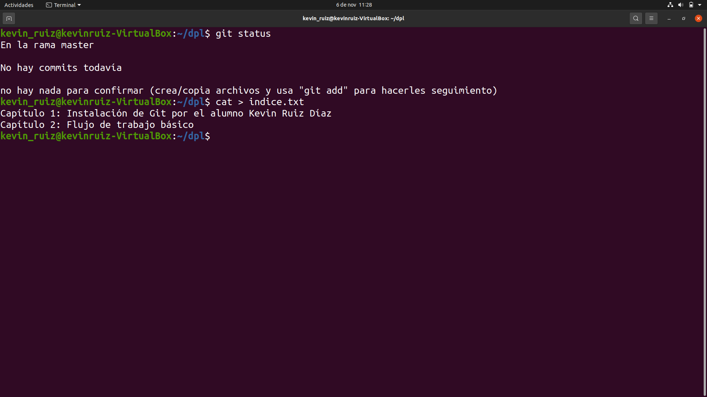
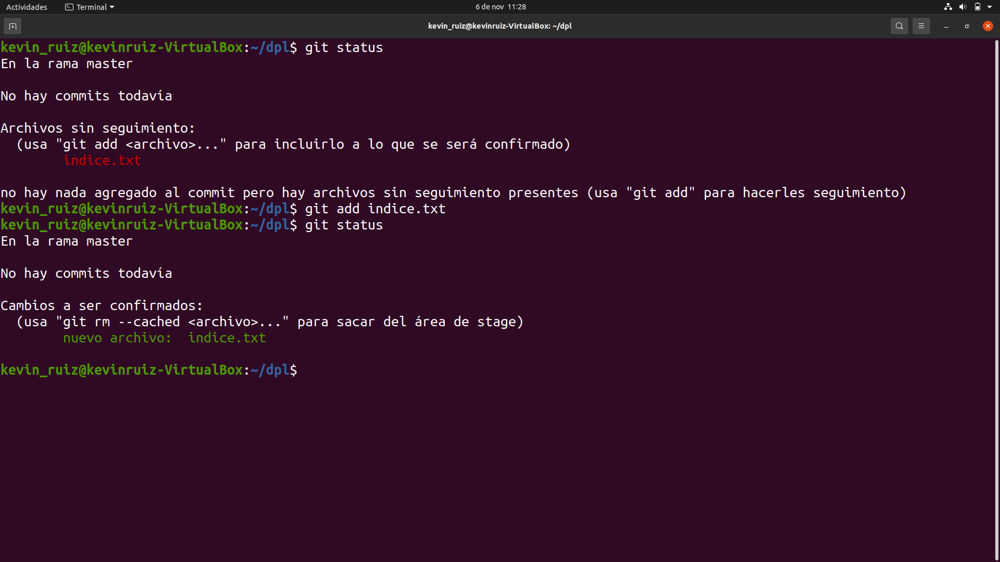
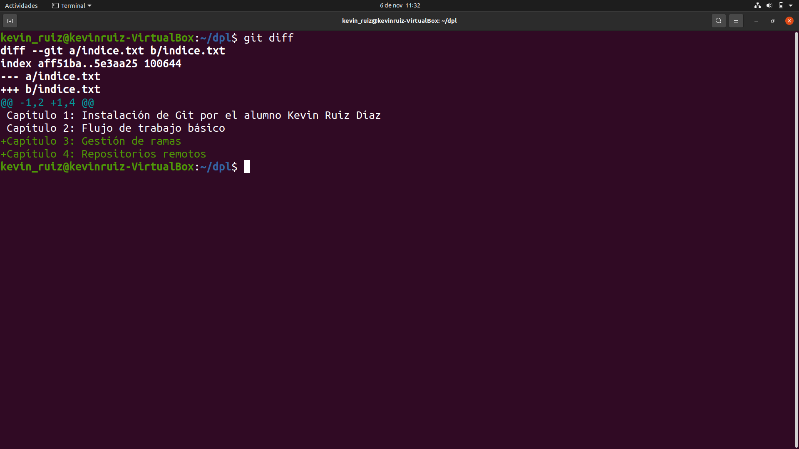
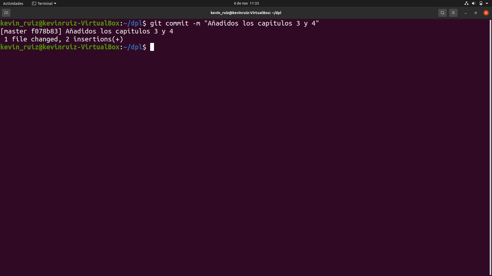
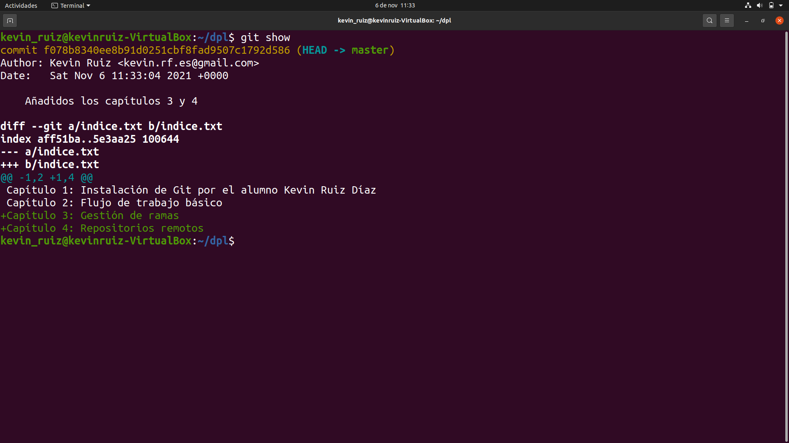
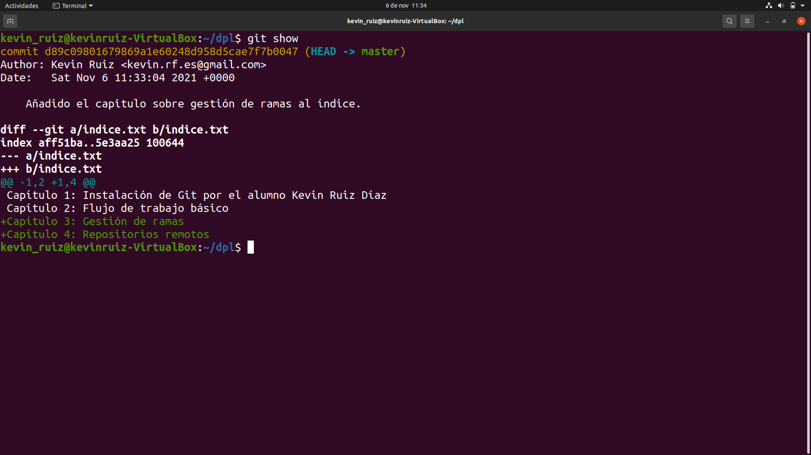

# Instalación Git

## Índice
* [Introducción](#introducción)  
<a name="introducción"/>

* [Requisitos](#requisitos)  
<a name="requisitos"/>

* [Configuración](#configuración)  
<a name="configuración"/>

* [Primer Repositorio](#primer-repositorio)  
<a name="primer-repositorio"/>

* [Manipulación Repositorio](#manipulación-repositorio)  
<a name="manipulación-repositorio"/>

* [Primer Commit](#primer-commit)  
<a name="primer-commit"/>

* [Historial](#historial)  
<a name="historial"/>

  ## Introducción
  En este proyecto, comenzaremos trabajar con Git a un nivel introductorio.
  
  Aprenderemos a crear el primer repositorio y a manipularlo de manera básica.
  
  Es de vital importancia aprender a manejar esta herramienta, pues será un habitual en la vida profesional de la mayoría de desarrolladores de cualquier ámbito.
  
  ## Requisitos
  En primer lugar, los pasos se harán desde una distribución de Linux, Ubuntu. Por lo que, aunque es posible trabajar con Git en otros sistemas operativos como Windows o macOS, los pasos pueden variar.
  
  En mi caso, estoy utilizando la aplicación “Virtualbox” para virtualizar Ubuntu en una máquina virtual. Los pasos son exactamente los mismos que si dicho sistema operativo estuviera instalado de forma nativa en el equipo.
  
  También debemos de asegurarnos de tener ya instalado Git en nuestro equipo. Para eso utilizaremos el comando:
  
    git --version
  
  En caso de no ser así, se puede revisar mi proyecto anterior sobre la instalación de Git.
  
  Necesitaremos también una conexión a internet.
  
  ## Configuración
  Para empezar, configuraremos Git con nuestra información. 
  
  Será tan sencillo como abrir nuestra terminal e introducir los comandos especificados a continuación: 
  
  * Para configurar su nombre de usuario:
  
    git config --global user.name "Su nombre"
  
  * Para configurar su dirección de correo electrónico:
  
    git config --global user.email "Su correo electrónico"
  
  * Para activar el coloreado de output:
  
    git config --global color.ui auto
  
  Finalmente, para comprobar todos los cambios que hemos hecho, utilizaremos: 
  
    git config --list
  
  En mi caso la lista se vería así:
  
   
  
  ## Primer repositorio
  En el siguiente paso, ya crearemos nuestro primer repositorio. En mi caso, este se llamará dpl. Se puede utilizar cualquier nombre que se desee.
  
  Para hacer esto, los pasos son los siguientes:
  
  * Para crear el nuevo directorio:
  
    mkdir dpl
  
  * Para cambiar a ese directorio:
  
    cd dpl
  
  * Para crear nuestro repositorio dentro de este directorio:
  
    git init
  
  Seguidamente con el comando:
  
    ls -la
  
  Mostramos el contenido.
  
  
  
  ## Manipulación repositorio
  Luego que ya hemos aprendido a crear nuestro primer repositorio, vamos a aprender a trabajar un poco con él.
  
  En primer lugar, comprobaremos su estado, introduciendo:
  
    git status
  
  
  
  Como vemos, este se encuentra vacío, así que vamos a hacerle unos cambios básicos.
  
  En primer lugar, crearemos un fichero índice con el comando: 
  
    cat > índice.txt
  
  Dentro de este le añadiré la siguiente información:
  
  * Capítulo 1: Instalación de Git por el alumno Kevin Ruiz Díaz
  
  * Capítulo 2: Flujo de trabajo básico
  
  Cuando hayamos rellenado con la información deseada, pulsamos la combinación de teclas Control + D para guardar.
  
  En este punto, se debería ver así:
  
  
  
  Los siguientes pasos son volver a utilizar el comando:
  
    git status
  
  Para comprobar como ha cambiado su estado. 
  
  Luego: 
  
    git add índice.txt
  
  Para añadirlo a la zona de intercambio temporal.
  
  Y finalmente: 
  
    git status
  
  De nuevo para comprobar el estado final de los cambios.  
  
  Debería acabar viéndose de la siguiente forma: 
  
    
  
  ## Primer Commit
  A continuación, aprenderemos como usar los commit.
  
  Para empezar, haremos algunos cambios en el archivo anterior. Para ello, volveremos a abrir nuestro índice, con el comando anteriormente usado: 
  
    cat > índice.txt
  
  Y añadiré dos nuevos capítulos:
  
  * Capítulo 3: Gestión de ramas
  
  * Capítulo 4: Repositorios remotos
  
  De nuevo, Ctrl + D para guardar.
  
  Y a continuación utilizaremos el comando:
  
    git diff
  
  Para que nos muestre los cambios respecto al último guardado:
  
  
  
  Como vemos, nos destaca los nuevos capítulos que introduje.
  
  Hacemos: 
  
    git add indice.txt
  
  Para volver a añadir el mismo. 
  
  Y en este punto haremos un commit, para dejar constancia sobre qué cambios hicimos. Tan sencillo como introducir:
  
    git commit -m "Añadidos los capitulos 3 y 4”
  
  
  
  ## Historial
  Finalmente, el último paso, será ver como funciona el historial de cambios.
  
  Primero, veremos el estado actual del repositorio, usando “git show”.
  
  
  
  Ahora, cambiaremos el mensaje del último commit. Para esto, añadiremos, por ejemplo:
  
    git commit --amend -m "Añadido el capítulo sobre gestión de ramas al índice."
  
  En último lugar volveremos a usar: 
  
    git show
  
  Para ver todos los cambios y debería verse algo así:
  
  
  

