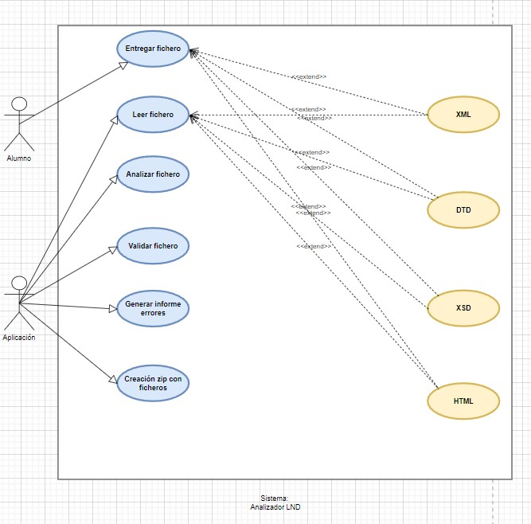

# Analizador LND

## Índice
* [Introducción](#introducción)  
<a name="introducción"/>

* [Actores](#actores)  
<a name="actores"/>

* [Casos de uso](#casos-de-uso)  
<a name="casos-de-uso"/>

  ## Introducción
  En el día de hoy vamos a realizar el documento de especificación del siguiente sistema.
  
  El analizador LND es un joven proyecto que tiene como objetivo ayudar a alumnos al desarrollo y corrección de tareas, de distintas asignaturas.
  
  ### Descripción General
  
  El presente proyecto tiene como objetivo desarrollar una aplicación en java para el análisis de ficheros en distintos lenguajes de marcas.

  ### Funcionamiento General
  
  La aplicación permitirá al usuario realizar al usuario distintas operaciones como leer ficheros
  (xml/dtd/xsd o html) inicialmente, así como de realizar el análisis de estos para encontrar posibles
  errores. Para conseguirlo inicialmente se realiza una validación de/los documento/s, verificando finalmente la correspondencia entre los ficheros xml, y los dtd o xsd, 
  si están referenciados internamente. Para cumplir con los objetivos de la aplicación , ayudar al alumnado, en caso de detectar
  errores, se genera un informe de errores, indicando la línea, y posición de este, así de una posible
  solución. Una vez verificado análisis, se posibilitará la creación automática de un zip con el conjunto
  de fichero implicados en la validación, para que el alumno pueda hacer entrega de la tarea.

  El diagrama del sistema es el siguiente:
  
  
  
  ## Actores 
  | Actor  | Alumno |
  | ------------- | ------------- |
  | Descripción  | Actor que hace uso de la aplicación  |
  | Características  |   |
  | Relaciones  |   |
  | Referencias  | Entregar ficheros  |
  | Notas  |   |
  | Autor | Kevin Ruiz Díaz  |
  | Fecha  | 01/01/2022  |
  
  | Actor  | Aplicación |
  | ------------- | ------------- |
  | Descripción  | Actor que se encarga de la funcionalidad del sistema  |
  | Características  |   |
  | Relaciones  |   |
  | Referencias  | Leer fichero, Analizar fichero, validar fichero, generar informe errores, creación zip con ficheros  |
  | Notas  |   |
  | Autor | Kevin Ruiz Díaz  |
  | Fecha  | 01/01/2022  |
  
  ## Casos de uso
  | Caso de uso  | Entregar fichero |
  | ------------- | ------------- |
  | Fuentes  | Documento sobre Analizador LND  |
  | Actor  | Alumno  |
  | Descripción  | El alumno podrá hacer entrega de un fichero, ya sea xml, dtd, xsd o html, para que la aplicación se encargue de analizarlo.  |
  | Flujo básico  | El alumno entregará su fichero y a continuación, dicho fichero será analizado por parte de la aplicación.  |
  | Pre-condiciones  |   |
  | Post-condiciones  |   |
  | Requerimientos  |   |
  | Notas  |   |
  | Autor | Kevin Ruiz Díaz  |
  | Fecha  | 01/01/2022  |
  
  | Caso de uso  | Leer fichero |
  | ------------- | ------------- |
  | Fuentes  | Documento sobre Analizador LND  |
  | Actor  | Aplicación  |
  | Descripción  | La aplicación leerá el fichero entregado por el alumno, ya sea xml, dtd, xsd o html.  |
  | Flujo básico  | Una vez el alumno ha entregado el fichero, la aplicación se encargará de leerlo  |
  | Pre-condiciones  |   |
  | Post-condiciones  |   |
  | Requerimientos  |   |
  | Notas  |   |
  | Autor | Kevin Ruiz Díaz  |
  | Fecha  | 01/01/2022  |
  
  | Caso de uso  | Analizar fichero |
  | ------------- | ------------- |
  | Fuentes  | Documento sobre Analizador LND  |
  | Actor  | Aplicación  |
  | Descripción  | La aplicación analizará el fichero entregado por el alumno  |
  | Flujo básico  | El alumno habrá entregado su fichero, la aplicación lo leerá para saber el tipo de fichero del que se trata y ahora se encargará de analizarlo para determinar su estado  |
  | Pre-condiciones  |   |
  | Post-condiciones  |   |
  | Requerimientos  |   |
  | Notas  |   |
  | Autor | Kevin Ruiz Díaz  |
  | Fecha  | 01/01/2022  |
  
  | Caso de uso  | Validar fichero |
  | ------------- | ------------- |
  | Fuentes  | Documento sobre Analizador LND  |
  | Actor  | Aplicación  |
  | Descripción  | La aplicación validará el fichero entregado por alumno  |
  | Flujo básico  | El alumno habrá entregado su fichero, la aplicación lo leerá para saber el tipo de fichero del que se trata, lo analizará y una vez analizado, se encargará de validarlo o no.  |
  | Pre-condiciones  |   |
  | Post-condiciones  |   |
  | Requerimientos  |   |
  | Notas  |   |
  | Autor | Kevin Ruiz Díaz  |
  | Fecha  | 01/01/2022  |
  
  | Caso de uso  | Generar informe errores |
  | ------------- | ------------- |
  | Fuentes  | Documento sobre Analizador LND  |
  | Actor  | Aplicación  |
  | Descripción  | La aplicación generará un informe de errores sobre el fichero entregado por el alumno  |
  | Flujo básico  | El alumno habrá entregado su fichero, la aplicación lo leerá para saber el tipo de fichero del que se trata, lo analizar, se encargará de validarlo o no y finalmente, devolverá un informe indicando los errores cometidos por el alumno.  |
  | Pre-condiciones  |   |
  | Post-condiciones  |   |
  | Requerimientos  |   |
  | Notas  |   |
  | Autor | Kevin Ruiz Díaz  |
  | Fecha  | 01/01/2022  |
  
  | Caso de uso  | Creación zip con ficheros |
  | ------------- | ------------- |
  | Fuentes  | Documento sobre Analizador LND  |
  | Actor  | Aplicación  |
  | Descripción  | La aplicación generará un archivo zip con los ficheros implicados en la validación, para que el alumno pueda hacer entrega de la tarea.  |
  | Flujo básico  | El alumno habrá entregado su fichero, la aplicación lo leerá para saber el tipo de fichero del que se trata, lo analizar, se encargará de validarlo o no y finalmente, devolverá un informe indicando los errores cometidos por el alumno. Una vez hecho esto, se generará un zip con todos los ficheros implicados.  |
  | Pre-condiciones  |   |
  | Post-condiciones  |   |
  | Requerimientos  |   |
  | Notas  |   |
  | Autor | Kevin Ruiz Díaz  |
  | Fecha  | 01/01/2022  |

