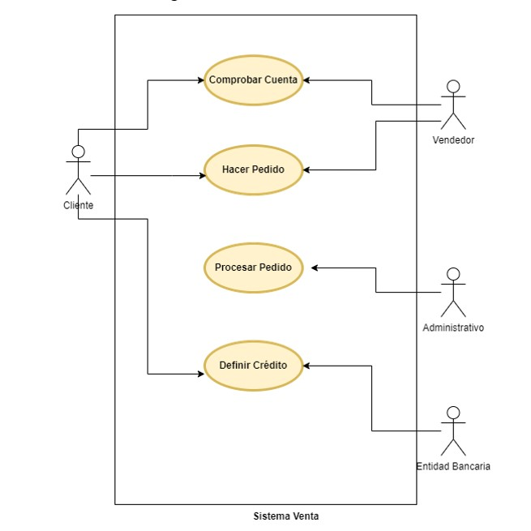

# Documento Especificación

## Índice
* [Introducción](#introducción)  
<a name="introducción"/>

* [Actores](#actores)  
<a name="actores"/>

* [Casos de uso](#casos-de-uso)  
<a name="casos-de-uso"/>

  ## Introducción
  En el día de hoy vamos a realizar el documento de especificación del siguiente sistema.
  
  El sistema estará formado por un conjunto de actores:

  * Cliente.

  * Vendedor.

  * Administrativo.

  * Entidad Bancaria.

  Y sus correspondientes casos de uso:
  
  
  * Comprobar Cuenta. Un cliente debe de tener una cuenta en la empresa para poder realizar un pedido. La verificación será realizada por el vendedor del establecimien-to.

  * Hacer Pedido. El cliente podrá realizar un pedido, a través del vendedor que lo asesora.

  * Procesar Pedido. Una vez realizado el pedido, el administrativo, será el encargado de procesar el pedido, emitiendo la correspondiente información dentro del sistema.

  * Definir Crédito. El cliente, debe tener una línea de crédito, que será establecida en función de su nómina, gastos mensuales, y crédito actual, si ya estuviera definida.

  El diagrama del sistema es el siguiente:
  
  
  
  ## Actores 
  | Actor  | Cliente |
  | ------------- | ------------- |
  | Descripción  | Actor que compra productos  |
  | Características  |   |
  | Relaciones  | Con actores Vendedor y Entidad Bancaria  |
  | Referencias  | Comprobar cuenta, hacer pedido y definir crédito  |
  | Notas  |   |
  | Autor | Kevin Ruiz Díaz  |
  | Fecha  | 02/12/2021  |
  
  | Actor  | Vendedor |
  | ------------- | ------------- |
  | Descripción  | Actor que ofrece productos  |
  | Características  |   |
  | Relaciones  | Con actor cliente  |
  | Referencias  | Comprobar cuenta y hacer pedido  |
  | Notas  |   |
  | Autor | Kevin Ruiz Díaz  |
  | Fecha  | 02/12/2021  |
  
  | Actor  | Administrativo |
  | ------------- | ------------- |
  | Descripción  | Actor que gestiona los pedidos  |
  | Características  |   |
  | Relaciones  |   |
  | Referencias  | Procesar pedidos  |
  | Notas  |   |
  | Autor | Kevin Ruiz Díaz  |
  | Fecha  | 02/12/2021  |
  
  | Actor  | Entidad bancaria |
  | ------------- | ------------- |
  | Descripción  | Actor que concede líneas de crédito  |
  | Características  |   |
  | Relaciones  | Con actor cliente  |
  | Referencias  | Define crédito  |
  | Notas  |   |
  | Autor | Kevin Ruiz Díaz  |
  | Fecha  | 02/12/2021  |
  
  ## Casos de uso
  | Caso de uso  | Comprobar cuenta |
  | ------------- | ------------- |
  | Fuentes  | Documento sobre Sistema Venta  |
  | Actor  | Cliente y Vendedor  |
  | Descripción  | Antes de realizar un pedido, el cliente debe tener una cuenta en la empresa y el vendedor se encargará de verificarlo  |
  | Flujo básico  | El vendedor verificará que el cliente tiene una cuenta en la empresa  |
  | Pre-condiciones  | El cliente debe crearse una cuenta, y en caso de tenerla, identificarse  |
  | Post-condiciones  |   |
  | Requerimientos  | El cliente debe tener una cuenta  |
  | Notas  |   |
  | Autor | Kevin Ruiz Díaz  |
  | Fecha  | 02/12/2021  |
  
  | Caso de uso  | Hacer pedido |
  | ------------- | ------------- |
  | Fuentes  | Documento sobre Sistema Venta  |
  | Actor  | Cliente y Vendedor  |
  | Descripción  | El vendedor asesorará al cliente a la hora de hacer un pedido  |
  | Flujo básico  | El cliente busca hacer un pedido, es asesorado por el vendedor y finalmente, el cliente decidirá si realiza el pedido o no  |
  | Pre-condiciones  |   |
  | Post-condiciones  |   |
  | Requerimientos  | El cliente debe tener una cuenta  |
  | Notas  |   |
  | Autor | Kevin Ruiz Díaz  |
  | Fecha  | 02/12/2021  |
  
  | Caso de uso  | Procesar pedido |
  | ------------- | ------------- |
  | Fuentes  | Documento sobre Sistema Venta  |
  | Actor  | Administrativo  |
  | Descripción  | Cuando se realiza un pedido el administrativo se encargará de gestionarlo  |
  | Flujo básico  | Se realiza un pedido y el administrativo procesa la información correspondiente en el sistema  |
  | Pre-condiciones  |   |
  | Post-condiciones  |   |
  | Requerimientos  |   |
  | Notas  |   |
  | Autor | Kevin Ruiz Díaz  |
  | Fecha  | 02/12/2021  |
  
  | Caso de uso  | Definir cŕedito |
  | ------------- | ------------- |
  | Fuentes  | Documento sobre Sistema Venta  |
  | Actor  | Cliente y Entidad bancaria  |
  | Descripción  | El cliente deberá tener una línea de crédito, que será concedida por la entidad bancaria  |
  | Flujo básico  | EL cliente solicita una línea de crédito y la entidad bancaria podrá concederla o no, en función de su nómina, gastos mensuales y crédito actual  |
  | Pre-condiciones  |   |
  | Post-condiciones  |   |
  | Requerimientos  |   |
  | Notas  |   |
  | Autor | Kevin Ruiz Díaz  |
  | Fecha  | 02/12/2021  |

